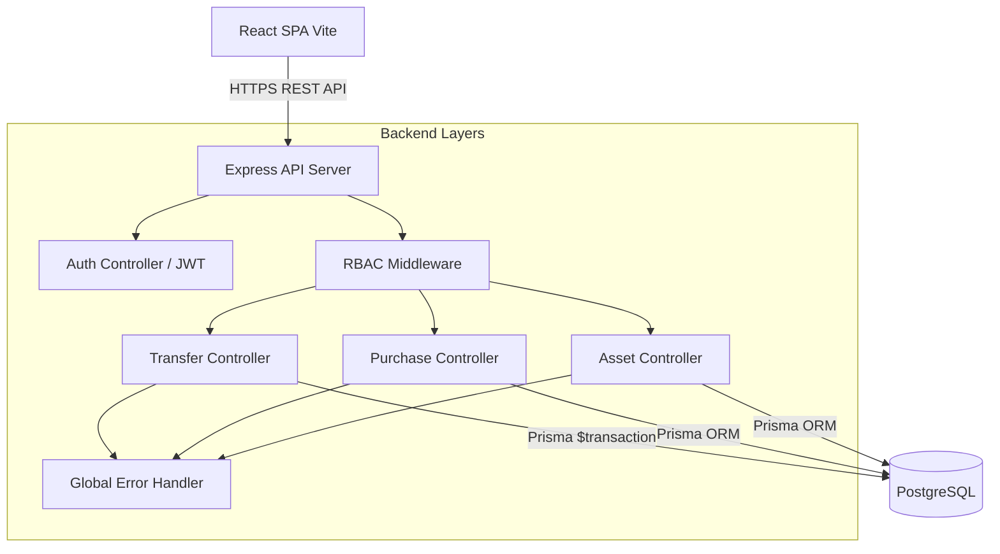
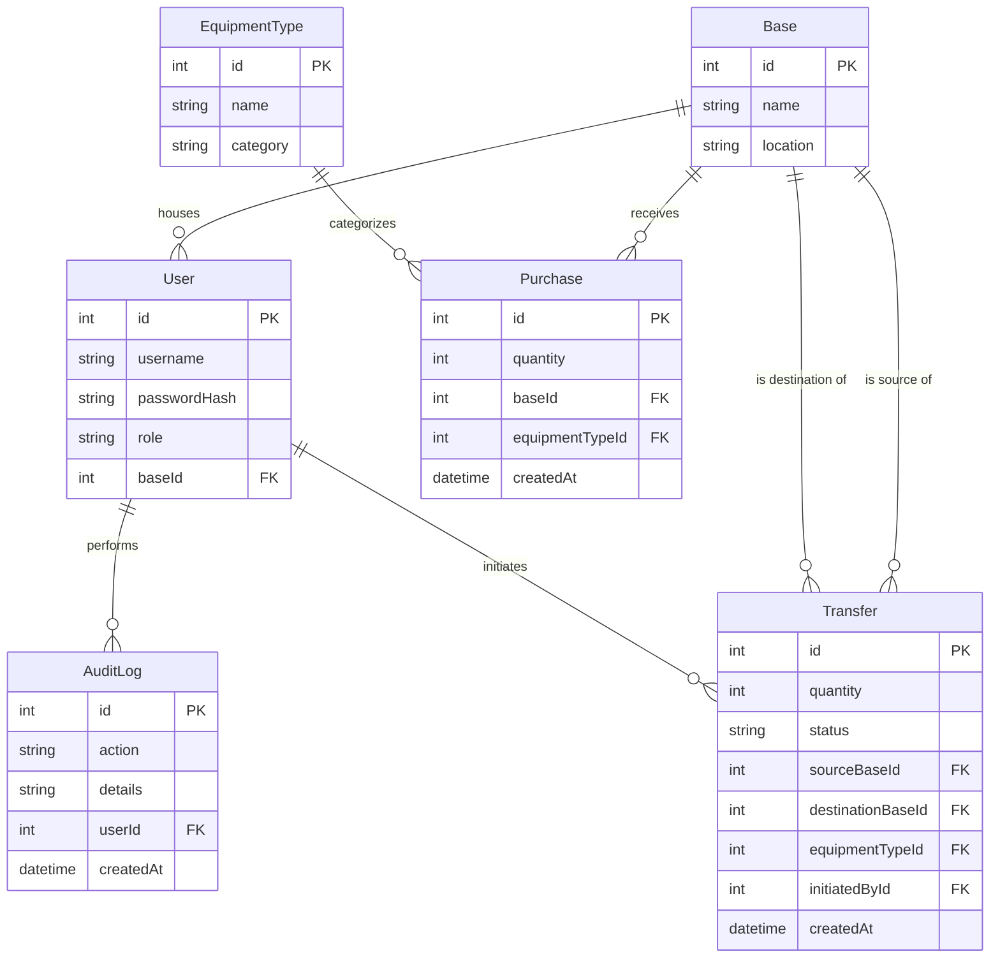
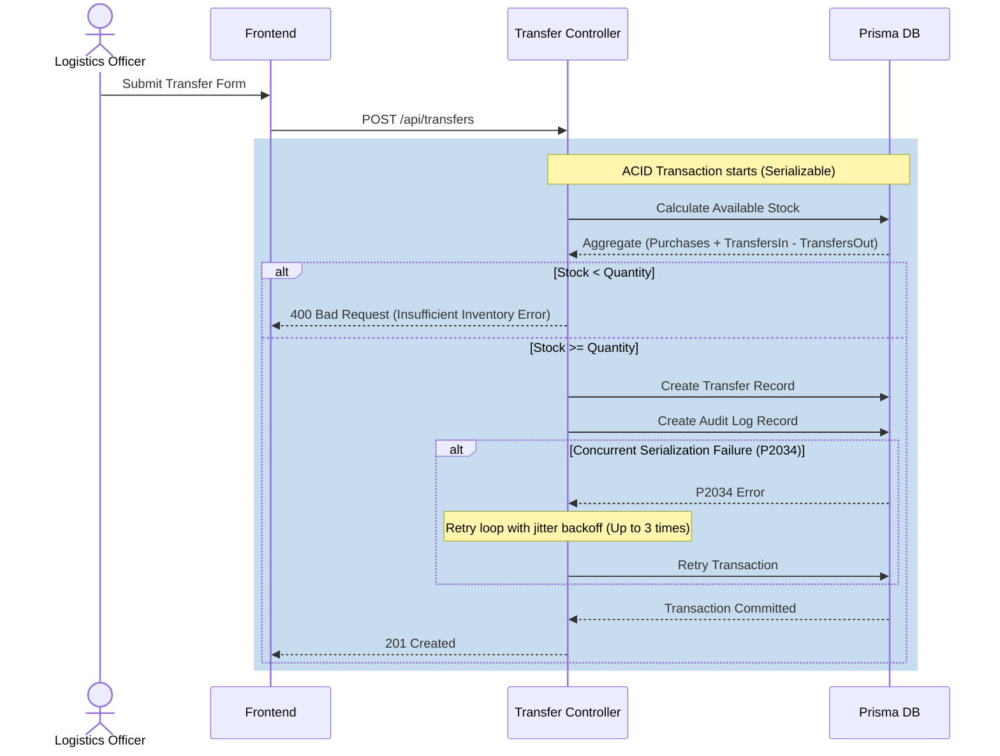
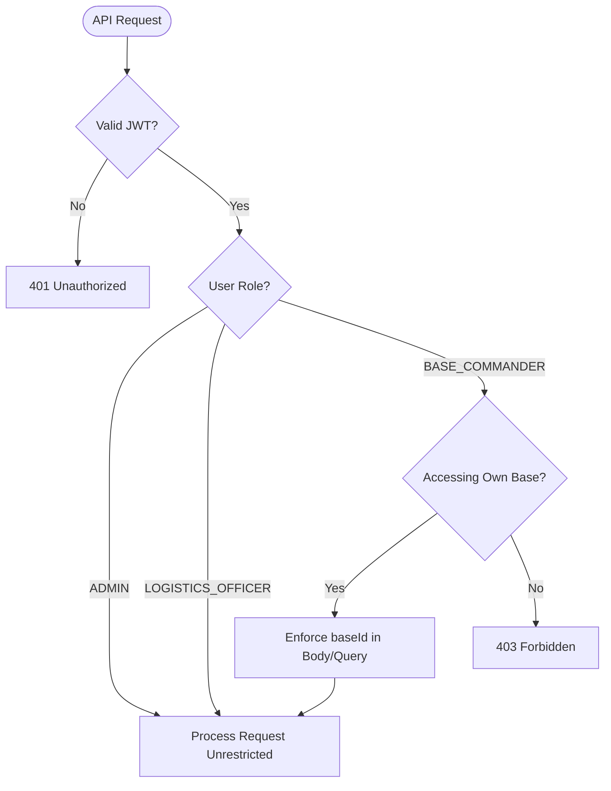

# Military Asset Management System (MAMS)

The Military Asset Management System (MAMS) is an enterprise-grade full-stack application designed to track critical military assets (vehicles, weapons, ammunition) across multiple military bases.

**Deployment Link:** [https://military-asset-management-system-omo4.onrender.com](https://military-asset-management-system-omo4.onrender.com)
**Video Demo:** [Your Demo Link Here]

## Features

- **End-to-End Asset Visibility:** Calculates real-time opening balances, net movements, assignments, expenditures, and closing balances dynamically without relying on duplicate data.
- **Operational Accountability:** Cross-base asset transfers are executed with strict database transactions (ACID compliance), locking, retry loops for concurrency (Serializable isolation), and backed by robust audit trails.
- **Granular Security (RBAC):** Strict Role-Based Access Control ensuring:
  - **Base Commanders** only view and manage assets related to their specific base.
  - **Logistics Officers** manage the global supply chain (purchases and transfers).
  - **Admins** have global, unrestricted control.
- **Centralized Error Handling:** Exhaustive error coverage across Prisma, Domain, Validation, Auth, and Infrastructure levels ensuring no internal stack traces leak.
- **Full E2E Testing:** Playwright is used to rigorously test complex RBAC scoping, inventory edge cases, concurrency, and security.

---

## 🏗️ System Architecture

The application is structured into a modern Node.js/React stack. The backend provides REST APIs, enforcing RBAC and executing transactions on Postgres via Prisma ORM.

---

## 🗄️ Database Schema

The relational schema strictly maps users to bases, and categorizes transfers and purchases with a strict audit log structure.

---

## 🔄 User Flows & Concurrency

### Transfer Creation & Concurrency Handling

MAMS handles cross-base transfers using a `Serializable` transaction isolation level. If multiple concurrent requests attempt to alter inventory simultaneously (e.g. `P2034` serialization failure), MAMS implements an exponential backoff with jitter to safely retry the transaction.

### RBAC Authorization Flow

Security is prioritized. Depending on the `role` encoded in the JWT, scopes are either unrestricted or strictly pinned to a `baseId`.

---

## 🚀 Deployment Guide (Render)

This project uses a unified multi-stage Dockerfile that builds the Vite frontend and the Express backend into a single container. The backend serves the compiled frontend assets directly from its `/public` folder.

1. Create a new "Web Service" in Render.
2. Select "Docker" as your runtime.
3. Add the following environment variables:
   - `DATABASE_URL`: Your Postgres connection string.
   - `JWT_SECRET`: A secure randomized secret key.
   - `PORT`: 5000 
4. The Docker container will automatically run `npx prisma db push --accept-data-loss` and seed the initial roles upon starting.

## 🔑 Sample Credentials

Since user registration is intentionally hidden for security, you must seed the database using `node prisma/seed.js` or via Docker deployment hooks. The default seeded credentials are:

| Role | Username | Password | Base Assigned |
| :--- | :--- | :--- | :--- |
| **Admin** | `admin_user` | `AdminPass123!` | Global |
| **Base Commander** | `commander_alpha` | `CommandPass123!` | Base #1 |
| **Logistics Officer** | `logistics_officer`| `LogisticsPass123!` | Global |

## 🛠️ Development Setup

1. **Clone & Install:**
   - Backend: `cd backend && npm install`
   - Frontend: `cd frontend && npm install`
2. **Database:** Create a Postgres DB and place the string in `backend/.env`.
3. **Run:** Start both servers using `npm run dev` in their respective folders.
